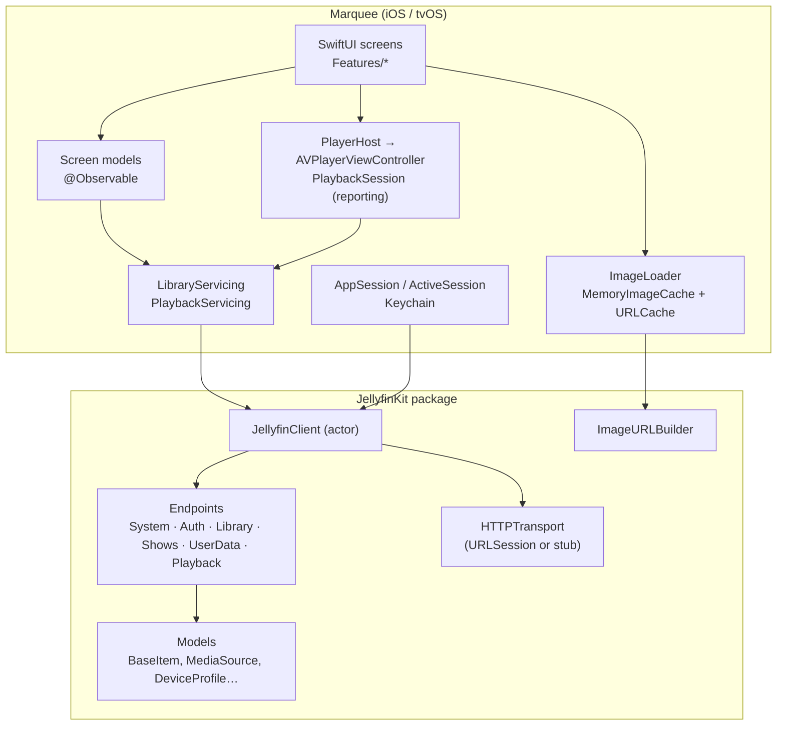
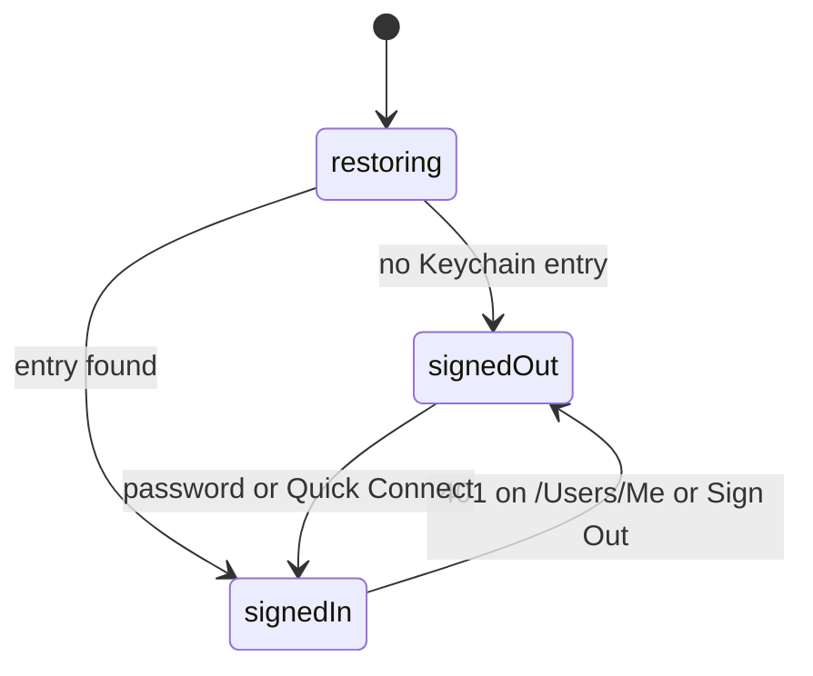
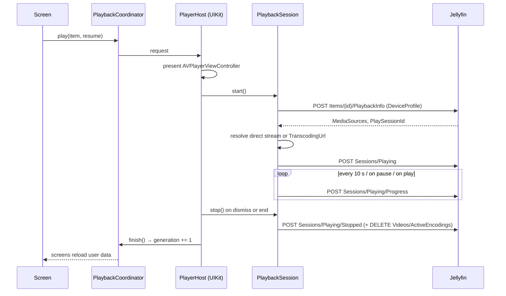

# Architecture

## Principles

- **Interfaces first.** Screens talk to `LibraryServicing` and `PlaybackServicing`. The Jellyfin
  implementations are thin adapters over typed endpoints. Swap them for stubs to preview or test.
- **One model per screen.** `@Observable` classes own loading state and mutations. Views render
  state and forward intent. No shared mutable singletons beyond the image caches.
- **Native or nothing.** System tab bar, navigation, search, player, focus engine. If a control
  looks custom, it's a bug.
- **Small files, domain folders.** Each feature folder holds its model and views. Components are
  shared only once two screens need them.

## Layers

## Session lifecycle

`AppSession` owns this. `ActiveSession` is created once per sign-in and injected into the
environment; it holds the client, the image URL builder and the two services.

## Playback

Direct play is preferred; the device profile is conservative and lives in `DeviceProfile.apple`.
Transcoded HLS starts at the requested offset server-side, so reported positions add that offset.

## Images

`ImageURLBuilder` snaps requested widths to buckets so the server's image cache and the client's
`URLCache` both hit. `RemoteImage` reads the memory cache synchronously on init, so scrolling back
to an already-seen card never flashes a placeholder. Decoding happens off the main thread via
`byPreparingForDisplay()`.

## Platform differences

| Concern | iOS | tvOS |
| --- | --- | --- |
| Tabs | Bottom tab bar, search tab role, minimise on scroll | Top tab bar |
| Cards | Plain button, whole card tappable | `.card` button style on artwork only; text below |
| Sort/filter | Toolbar menu | Inline bar above the grid |
| Sign in | Password first, Quick Connect optional | Quick Connect starts automatically |
| Settings | Sheet from Home | Its own tab |
| Player dismissal | Done button | Menu button |

All of it is expressed with `Metrics` and `#if os(tvOS)`; there are no duplicated screens.
