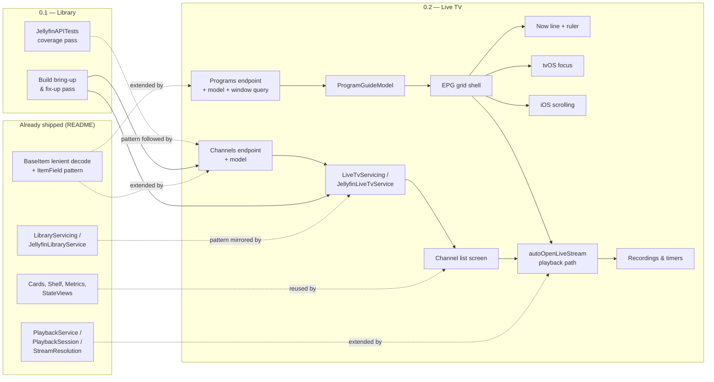

# Backlog

Working backlog for Marquee, organised as epics and issues per milestone. Written to be copied
into GitHub Issues/Projects: each issue below is meant to become one GitHub issue (title as the
issue title, the rest as the body), each epic a milestone label or tracking issue with the epic's
issues as sub-issues/checklist items. Sizes are rough: **S** ≈ under a day, **M** ≈ a few days,
**L** ≈ a week or more / needs its own design pass.

See [docs/ROADMAP.md](ROADMAP.md) for the feature-level plan this refines, and
[docs/LIVE_TV_DESIGN.md](LIVE_TV_DESIGN.md) for the design this backlog's 0.2 section implements.

## Definition of Done

Every issue in this backlog is done only when:

- [ ] Both schemes build clean: `Marquee` (iOS Simulator) and `Marquee TV` (tvOS Simulator)
- [ ] No new build warnings (Swift 6 strict concurrency included)
- [ ] `swift test --package-path Packages/JellyfinKit` passes, with a new test for any
      `JellyfinKit` addition (new endpoint, model, decoding rule, or pure-logic change)
- [ ] Checked by hand on both iOS and tvOS where the change touches shared UI — no layout
      glitches, clipped text, or focus traps at typical iPhone/iPad/Apple TV sizes
- [ ] VoiceOver labels (iOS) and focus-engine narration (tvOS) are correct for any new
      interactive element
- [ ] `xcodegen generate` re-run and the project still opens, if file layout or `project.yml`
      changed
- [ ] No unmarked gaps — anything deferred or stubbed carries a `// TODO:` explaining what's
      missing and why

This mirrors [CONTRIBUTING.md](../CONTRIBUTING.md)'s PR checklist; that file is the canonical
version if the two ever drift.

## 0.1 → 0.2 path

What 0.1's bring-up work and existing patterns feed into 0.2's Live TV epics:

## Milestone 0.1 — Library

### Epic: Build bring-up and quality gate

#### First build and fix-up pass on device and simulator

The app has never been built from this environment. Run `xcodegen generate`, open the project,
build both schemes on real hardware and the simulator, and fix whatever the first build surfaces
— signing, missing assets, deprecated API warnings, layout issues invisible from reading code
alone.

**Acceptance criteria**
- [ ] `Marquee` builds and runs on an iOS simulator and a physical iPhone/iPad
- [ ] `Marquee TV` builds and runs on a tvOS simulator and a physical Apple TV
- [ ] Sign-in, Home, Library, Detail, Search and Player all reach a real Jellyfin server
      end-to-end at least once each
- [ ] Every issue found is filed as its own backlog item rather than fixed silently in passing

**Size**: M · **Dependencies**: none · **Endpoints**: none (verification pass)

---

#### Swift 6 strict concurrency warning sweep

Both `Marquee` and `JellyfinAPI` build in Swift 6 language mode. Confirm a clean build genuinely
has zero concurrency warnings (data races, non-`Sendable` capture, actor isolation) rather than
warnings suppressed by `@unchecked Sendable` or `@preconcurrency` imports, and document any
warning that's fixed by an escape hatch with a comment explaining why it's safe.

**Acceptance criteria**
- [ ] Clean build of both schemes with zero warnings
- [ ] Every `@unchecked Sendable` / `@preconcurrency` in the tree has a one-line comment
      justifying it
- [ ] Result captured as a note in this file or a follow-up issue if any warning needs a real
      redesign rather than a local fix

**Size**: S · **Dependencies**: First build and fix-up pass · **Endpoints**: none

---

#### App icon and Top Shelf artwork

`Marquee/iOS/Assets.xcassets/AppIcon.appiconset` and the tvOS `App Icon & Top Shelf Image`
brand assets are currently empty `Contents.json` scaffolding with no images. Design and drop in
real artwork for both platforms, including the tvOS layered icon (front/back image stack) and the
wide Top Shelf image.

**Acceptance criteria**
- [ ] iOS app icon renders correctly at every required size (check the Home Screen and Settings)
- [ ] tvOS app icon renders with correct parallax (front/back layers) on the Home Screen
- [ ] tvOS Top Shelf image renders without letterboxing or stretching
- [ ] No leftover placeholder/default Xcode icon anywhere in either target

**Size**: S · **Dependencies**: none · **Endpoints**: none

---

#### VoiceOver and tvOS focus accessibility audit

Sweep every existing screen (Home, Library, Detail, Search, Player, Settings, Onboarding) with
VoiceOver on iOS and focus-engine narration on tvOS. Several views already set
`.accessibilityElement`/labels (`Cards.swift`, `Shelf.swift`, `CastShelf.swift`); confirm the rest
match, and that icon-only controls (favourite, play/pause overlays, sort/filter menus) all read
sensibly rather than "button".

**Acceptance criteria**
- [ ] Every icon-only interactive control has a descriptive `.accessibilityLabel`
- [ ] Grouped card/shelf content reads as one VoiceOver stop, not three
- [ ] tvOS focus order is logical top-to-bottom, left-to-right on every screen
- [ ] Dynamic Type up to at least "Accessibility Large" doesn't clip or truncate primary content
      on iOS

**Size**: M · **Dependencies**: First build and fix-up pass · **Endpoints**: none

### Epic: Content polish

#### Genre browse screen

`LibraryEndpoints.genres(userID:parentID:)` already exists in `JellyfinKit` but nothing in the app
calls it. Add a genre list per library (or globally) and route into `LibraryBrowseView` filtered
by genre, matching the existing person-filmography pattern (`BrowseScope.person`).

**Acceptance criteria**
- [ ] A genre list is reachable from a library's browse screen on both platforms
- [ ] Tapping/selecting a genre opens a filtered `LibraryBrowseView`
- [ ] `BrowseScope` gains a `.genre` case with its own default sort, following the existing
      `.person`/`.container` pattern in `LibraryBrowseModel`
- [ ] Empty genre (no items) shows the existing empty state, not a blank screen

**Size**: M · **Dependencies**: none · **Endpoints**: `Genres`, `Users/{userId}/Items` (existing, `genres` filter)

---

#### Trailer playback from item detail

`ItemKind.trailer` exists and `BaseItem.isPlayable` already includes it, but nothing fetches or
surfaces a "Play Trailer" action. Movies/series can carry local trailers (child items) and/or
`RemoteTrailers` (external URLs); support at least local trailers through the existing player,
since remote URLs (usually YouTube) don't fit `AVPlayerViewController` without a webview escape
hatch.

**Acceptance criteria**
- [ ] `ItemField`/query additions to fetch local trailer items for a movie/series
- [ ] A "Play Trailer" button appears on `ItemDetailView`/`SeriesDetailView` when a local trailer
      exists, hidden otherwise
- [ ] Trailer plays through the existing `PlaybackCoordinator`/`PlayerHost` path, no progress
      reporting oddities (trailers shouldn't mark the parent item watched)
- [ ] Remote-only trailers (no local trailer item) are a documented `// TODO:` rather than a
      silent no-op

**Size**: M · **Dependencies**: none · **Endpoints**: `Users/{userId}/Items` (`LocalTrailerCount`/child query), `Items/{id}/PlaybackInfo`

---

#### Collection membership link on item detail

A movie that belongs to a box set currently has no way to reach that box set from its detail
screen even though `LibraryBrowseView` already renders box sets fine via `Route.item` →
`.boxSet` routing. Add a "Part of *Collection Name*" link on movie detail when applicable.

**Acceptance criteria**
- [ ] Movie detail shows a collection link when the item has a parent box set
- [ ] Tapping it pushes `Route.item(boxSet)`, reusing existing routing (no new destination type)
- [ ] No link shown, no layout gap, for movies outside any collection

**Size**: S · **Dependencies**: none · **Endpoints**: `Users/{userId}/Items/{itemId}` with fields that include collection membership (e.g. querying `Users/{userId}/Items?includeItemTypes=BoxSet` and checking membership, or the collection field already returned when present)

---

#### Skip intro / chapter markers UI

`ItemField.chapters` is already modelled per the roadmap note but there's no UI consuming chapter
data. Add a chapter list/scrubber affordance to the player and, where a chapter is marked as an
intro (`ChapterInfo.markerType` on newer servers, or a naive "first chapter under N minutes"
heuristic where the server doesn't tag it), a "Skip Intro" button.

**Acceptance criteria**
- [ ] Chapters fetched via `ItemField.chapters` are exposed to `PlaybackSession`/`PlayerHost`
- [ ] A chapter menu is reachable from the system player's UI (not a custom overlay — see
      "no custom controls" in `CONTRIBUTING.md`)
- [ ] A "Skip Intro" affordance appears only during a detected intro chapter and disappears once
      skipped or passed
- [ ] Works for both direct play and transcoded streams

**Size**: M · **Dependencies**: none · **Endpoints**: `Users/{userId}/Items/{itemId}` (`fields=Chapters`)

---

#### Continue Watching row actions

Home's Continue Watching shelf has no way to remove an item or mark it watched without opening
detail first. Add a context action (long-press on tvOS, swipe or context menu on iOS) for
"Mark Watched" and "Remove from Continue Watching".

**Acceptance criteria**
- [ ] Long-press (tvOS) / context menu or swipe (iOS) on a Continue Watching card offers both
      actions
- [ ] "Mark Watched" calls the existing `setPlayed` path and removes the card optimistically
- [ ] "Remove from Continue Watching" resets playback position to zero via the same played/
      progress endpoints (there's no separate "hide" endpoint) and removes the card optimistically
- [ ] A failed request restores the card, matching `ItemDetailModel`'s existing optimistic-update
      pattern

**Size**: S · **Dependencies**: none · **Endpoints**: `Users/{userId}/PlayedItems/{itemId}`, `Users/{userId}/Items/Resume`

---

#### Empty and error state consistency pass

`StateViews.swift` already defines shared empty/error/loading views; confirm every screen
(Home, Library, Search, Detail, Player) actually uses them consistently rather than ad hoc text,
and that error states offer a retry action where a retry makes sense.

**Acceptance criteria**
- [ ] Every screen's loading/empty/error path uses `StateViews`, no bespoke inline equivalents
- [ ] Every error state that can plausibly be retried (network failure, timeout) has a working
      retry button
- [ ] Empty states have platform-appropriate copy (no "tap" language on tvOS)

**Size**: S · **Dependencies**: none · **Endpoints**: none

---

#### Search scope and empty-state refinement

`SearchModel`/`SearchView` search across everything with no way to narrow by type, and the
empty/no-results copy hasn't been reviewed. Add a type filter (Movies / Shows / Episodes / All)
and confirm zero-result copy is helpful rather than generic.

**Acceptance criteria**
- [ ] A scope control (segmented on iOS, inline on tvOS per the existing sort/filter pattern)
      narrows `ItemsQuery.includeItemTypes`
- [ ] Debounce/cancellation behaviour (already in place) is unaffected by adding the filter
- [ ] No-results state explains the current scope ("No episodes matching …", not a bare "No
      results")

**Size**: S · **Dependencies**: none · **Endpoints**: `Users/{userId}/Items` (`searchTerm`, `includeItemTypes`)

---

#### Studios and tags on item detail

`ItemDetailView` shows genres but `JellyfinLibraryService.detailFields` already fetches
`.studios` without the view displaying them, and tags aren't fetched at all. Bring studios and
tags to parity with genres' existing display treatment.

**Acceptance criteria**
- [ ] Studios render alongside genres on movie/series detail when present
- [ ] `ItemField.tags` (or equivalent) added to `detailFields` and rendered, or explicitly
      deferred with a `// TODO:` if design wants tags hidden from users
- [ ] No layout regression on either platform at long genre/studio lists

**Size**: S · **Dependencies**: none · **Endpoints**: `Users/{userId}/Items/{itemId}` (`fields=Studios,Tags`)

### Epic: Test coverage

#### Expand JellyfinAPITests coverage for Library and Shows endpoints

`ClientTests`, `DecodingTests`, `ImageURLBuilderTests`, `ServerAddressTests` and
`StreamResolutionTests` exist, but `LibraryEndpoints`/`ShowsEndpoints`' query-building (the
`ItemsQuery.queryItems` logic in particular — filters, sort, paging, image-type hints) has no
dedicated test file. Add one before it grows further with 0.2's `LiveTvEndpoints`.

**Acceptance criteria**
- [ ] A new `LibraryEndpointsTests.swift` (or similarly named) covers `ItemsQuery` building for
      at least: empty query, full filter set, paging, and the `resume`/`latest`/`nextUp` fixed
      query shapes
- [ ] Uses the existing `StubTransport` pattern, no live network access
- [ ] `swift test --package-path Packages/JellyfinKit` stays green

**Size**: S · **Dependencies**: none · **Endpoints**: none (test-only)

## Milestone 0.2 — Live TV

See [docs/LIVE_TV_DESIGN.md](LIVE_TV_DESIGN.md) for the full design behind this section.

### Epic: Channels foundation

#### Fix `ItemKind.liveTvProgram` raw value mismatch

`Enums.swift` maps `.liveTvProgram` to raw value `"TvProgram"`; Jellyfin's server sends
`"Program"` for program items. Harmless today because nothing decodes programs yet and
`LenientStringEnum` falls back to `.unknown` rather than throwing, but must be fixed before any
Live TV code branches on `item.type == .liveTvProgram`.

**Acceptance criteria**
- [ ] Raw value corrected to `"Program"`
- [ ] `DecodingTests` gains a case decoding a `Type: "Program"` item and asserting
      `.liveTvProgram`, not `.unknown`
- [ ] Checked against a real Jellyfin server response (or the Jellyfin OpenAPI spec) to confirm
      the exact string, not guessed

**Size**: S · **Dependencies**: none · **Endpoints**: none (model fix)

---

#### Add `LiveTvEndpoints.channels` and channel model fields

Add a `LiveTvEndpoints` enum (mirroring `LibraryEndpoints`) with a `channels` call, plus the
channel-specific fields (`channelNumber`, `channelType`, favourite flag) that `BaseItem` needs
decoded when `Type == TvChannel`, following the existing optional-field decode pattern.

**Acceptance criteria**
- [ ] `LiveTvEndpoints.channels(userID:isFavorite:sortBy:startIndex:limit:)` returns
      `QueryResult<BaseItem>`
- [ ] `BaseItem` decodes `ChannelNumber` and a new `ChannelType` enum (`.tv`, `.radio`) when
      present, without breaking decoding of non-channel items
- [ ] `DecodingTests` covers a sample channel JSON payload

**Size**: M · **Dependencies**: none · **Endpoints**: `LiveTv/Channels`

---

#### Channel list screen

A plain list/grid of channels (logo, number, name), sorted by number by default, with favourites
surfaced first — the foundation the EPG grid's channel column reuses. Ships as its own screen
first so channel data, favouriting and navigation land before the more complex grid work.

**Acceptance criteria**
- [ ] Channel list reachable from wherever Live TV's entry point lands (pending the entry-point
      issue below; a temporary route is fine to unblock this work)
- [ ] Favourite toggle reuses `UserDataEndpoints.markFavorite`/`unmarkFavorite`, matching the
      optimistic-update pattern in `ItemDetailModel`
- [ ] Reuses `Cards`/`RemoteImage` for channel logos rather than a bespoke row view
- [ ] Selecting a channel plays it (depends on the playback issue below; stub the action if that
      lands later)

**Size**: M · **Dependencies**: Add `LiveTvEndpoints.channels` · **Endpoints**: `LiveTv/Channels`, `Users/{userId}/FavoriteItems/{itemId}`

---

#### `LiveTvServicing` protocol and `JellyfinLiveTvService`

Introduce a `LiveTvServicing` protocol mirroring `LibraryServicing`'s shape (screens depend on
the protocol, never on `JellyfinClient` directly), backed by a `JellyfinLiveTvService` struct.
This is the seam every other 0.2 screen model builds on.

**Acceptance criteria**
- [ ] `LiveTvServicing` exposes `channels()`, `programs(channelIDs:window:)`, `recordings()`,
      `timers()`, `seriesTimers()` at minimum
- [ ] `JellyfinLiveTvService` implements it over `LiveTvEndpoints`
- [ ] Injected into `ActiveSession` alongside `library`/`playback`, following the existing
      initialisation pattern
- [ ] A stub conforming to `LiveTvServicing` exists for previews, matching how other services are
      previewed

**Size**: S · **Dependencies**: Add `LiveTvEndpoints.channels` · **Endpoints**: none directly (composition)

### Epic: EPG grid

#### Add `LiveTvEndpoints.programs` and windowed query builder

Add the `LiveTv/Programs` call with a `ProgramsQuery` (mirroring `ItemsQuery`'s builder style):
`channelIds`, `minStartDate`, `maxStartDate`, plus the program-specific `BaseItem` fields
(`startDate`, `endDate`, `channelId`, `isLive`, `isRepeat`, `isNews`/`isSeries`/`isMovie`/
`isSports`/`isKids`).

**Acceptance criteria**
- [ ] `LiveTvEndpoints.programs(channelIDs:window:fields:)` returns `QueryResult<BaseItem>`
- [ ] `channelIds` batching considered (see design doc's open question) — at minimum, document
      the batch-size assumption with a `// TODO:` if not solved outright
- [ ] `DecodingTests` covers a sample program JSON payload including the corrected
      `.liveTvProgram` type

**Size**: M · **Dependencies**: Fix `.liveTvProgram` raw value; `LiveTvServicing` protocol · **Endpoints**: `LiveTv/Programs`

---

#### `ProgramGuideModel`: window state, gap-filling, prefetch and eviction

The screen model backing the EPG grid. Owns the current time window, keeps at most three windows
of program data in memory, gap-fills missing coverage with placeholder "No Data" items, and
prefetches the adjacent window once the visible offset crosses a threshold — see the design doc's
sequence diagram.

**Acceptance criteria**
- [ ] `GuideWindow`/`ChannelRow` types match the design doc's shapes (or a documented variant)
- [ ] Scrolling within the loaded window never blocks on a network call
- [ ] Crossing ~70% of the current window triggers a prefetch of the next one; the window
      furthest from view is evicted, capped at three in memory
- [ ] Paging is bounded by `LiveTv/GuideInfo`'s known data range — no requests for windows outside
      it
- [ ] Gaps in server data render as a distinct "No Data" cell, not a layout hole

**Size**: L · **Dependencies**: Add `LiveTvEndpoints.programs` · **Endpoints**: `LiveTv/Programs`, `LiveTv/GuideInfo`

---

#### EPG grid shell: fixed channel column and synchronised horizontal scroll

The core layout: a vertical list of channel rows, each a horizontally-scrolling `HStack` of
program cells, with one shared scroll offset and a pinned leading channel column. This is the
riskiest UI piece in 0.2 and worth its own issue separate from focus/scroll-input polish.

**Acceptance criteria**
- [ ] Channel column stays fixed while every row's programs scroll together on one shared offset
- [ ] Cell width is `pointsPerMinute * durationMinutes` via a new `Metrics` constant (tvOS/iOS
      values), with a sane minimum width for short programs
- [ ] Time ruler scrolls in lockstep with program cells
- [ ] No 2-D `ScrollView` — nested vertical list of horizontal scrolls only, per the design doc's
      rejected-alternative note

**Size**: L · **Dependencies**: `ProgramGuideModel`; Channel list screen · **Endpoints**: none (pure UI, consumes the model)

---

#### "Now" line and time ruler

The vertical "now" indicator overlaid across every row at the correct x-position for the current
time, recomputed roughly once a minute, plus the half-hour time ruler above the channel rows.

**Acceptance criteria**
- [ ] "Now" line renders at the correct offset within the loaded window and updates at least
      once a minute via `TimelineView(.periodic(from:by:))` or equivalent, not a per-frame timer
- [ ] Ruler and "now" line share the same coordinate space as program cells, so both scroll
      together with the grid
- [ ] Line is visually distinct on both light content and busy channel logos (contrast checked
      in both system colour schemes)

**Size**: M · **Dependencies**: EPG grid shell · **Endpoints**: none

---

#### tvOS focus behaviour for the guide

Wire the Siri Remote/focus engine path: default focus lands on the current program on first
presentation, vertical focus moves row to row, horizontal moves cell to cell, and scroll follows
focus rather than being driven separately.

**Acceptance criteria**
- [ ] `.defaultFocus` lands on the "now" cell on first presentation
- [ ] Focus moves predictably in all four directions with no dead ends or skipped rows
- [ ] Scroll position follows focus via `scrollPosition`/`ScrollViewReader`, no manual offset math
- [ ] A remote-mapping decision for "jump a day forward/back" is made and documented (design
      doc's open question) rather than left unresolved

**Size**: M · **Dependencies**: EPG grid shell · **Endpoints**: none

---

#### iOS drag scrolling and "jump to now"

The iOS-side interaction: normal drag scrolling within rows, plus a toolbar action or edge
gesture that resets the guide to the current time window.

**Acceptance criteria**
- [ ] Drag scrolling works naturally across all rows without fighting the shared offset binding
- [ ] A visible "Now" action resets `guideOffset`/window to the current time
- [ ] Tapping an in-progress program plays it; tapping a future program opens the program detail
      sheet instead

**Size**: M · **Dependencies**: EPG grid shell · **Endpoints**: none

---

#### Program detail sheet

Tapping/selecting a program (current or future) shows its synopsis, timing and channel, with a
"Record" action wired once the recordings epic lands (stub it as disabled/hidden until then).

**Acceptance criteria**
- [ ] Sheet shows title, synopsis, start/end time, channel name and relevant badges
      (Live/Repeat/New)
- [ ] Reachable from both the guide grid and (once it exists) the channel list's "what's on now"
- [ ] "Record" action present but inert (or hidden behind a `// TODO:`) until the Recordings
      epic's Timers/Defaults issue lands

**Size**: M · **Dependencies**: EPG grid shell · **Endpoints**: none directly (renders data already fetched)

### Epic: Watch live

#### `autoOpenLiveStream` playback path

Extend `PlaybackInfoRequest` with `autoOpenLiveStream: true` and teach `PlaybackService`/
`PlaybackSession` to request it for channel items, reusing the existing `resolveStream` /
`StreamResolution` logic. Live streams never have a meaningful seek position, so progress
reporting's "start ticks" concept is skipped for this path while `Sessions/Playing`/
`Sessions/Playing/Stopped` calls still fire for correct server-side session accounting.

**Acceptance criteria**
- [ ] `PlaybackInfoRequest` gains `autoOpenLiveStream`, set only for channel playback
- [ ] `PlaybackService.prepare` branches on item type (channel vs. VOD) without duplicating the
      whole method — extract the shared parts
- [ ] `PlaybackSession` skips local seeking and periodic position-based progress ticks for live
      playback, but still reports start/stop
- [ ] Direct-play and transcoded live streams both resolve through the existing
      `resolveStream` logic with no separate code path for the URL itself

**Size**: M · **Dependencies**: Channel list screen · **Endpoints**: `Items/{channelId}/PlaybackInfo` (`autoOpenLiveStream`), `Sessions/Playing`, `Sessions/Playing/Stopped`

### Epic: Recordings and timers

#### `LiveTvEndpoints` for Recordings, Timers and SeriesTimers

Add the remaining Live TV endpoints and their response models (`Timer`, `SeriesTimer` — not
`BaseItem`s, per the design doc) to `JellyfinKit`.

**Acceptance criteria**
- [ ] `LiveTvEndpoints.recordings`, `.timers`, `.timerDefaults(programID:)`, `.seriesTimers`
      added, each with create/delete variants where the API supports them
- [ ] New `Models/LiveTvModels.swift` holds `Timer`/`SeriesTimer`/`NewTimerDefaults` with
      `DecodingTests` coverage
- [ ] `LiveTvServicing` extended with matching methods

**Size**: M · **Dependencies**: `LiveTvServicing` protocol · **Endpoints**: `LiveTv/Recordings`, `LiveTv/Timers`, `LiveTv/Timers/Defaults`, `LiveTv/SeriesTimers`

---

#### Recordings list and playback

Completed and in-progress recordings, browsable like any other library item (`Type=Recording`
already has an `ItemKind` case) and playable through the existing VOD-style `PlaybackSession`
path since recordings behave like normal video files server-side.

**Acceptance criteria**
- [ ] Recordings list shows in-progress and completed recordings distinctly
- [ ] Playback reuses the existing (non-live) `PlaybackService.prepare` path unchanged
- [ ] Delete action available for completed recordings, with confirmation

**Size**: M · **Dependencies**: `LiveTvEndpoints` for Recordings/Timers/SeriesTimers · **Endpoints**: `LiveTv/Recordings`, `LiveTv/Recordings/{id}`

---

#### Record action and series recording rules

Wire the program detail sheet's "Record" action using `LiveTv/Timers/Defaults` to prefill a
single-event timer, plus a way to create/cancel a series recording rule from a series-type
program.

**Acceptance criteria**
- [ ] "Record" on a single program creates a `Timer` via `Timers/Defaults` → `POST Timers`
- [ ] A series-flagged program offers "Record Series" creating a `SeriesTimer`
- [ ] Existing timers/series timers can be cancelled from the recordings list or program detail
- [ ] Optimistic UI on create/cancel, matching `ItemDetailModel`'s pattern, with rollback on
      failure

**Size**: M · **Dependencies**: `LiveTvEndpoints` for Recordings/Timers/SeriesTimers; Program detail sheet · **Endpoints**: `LiveTv/Timers/Defaults`, `LiveTv/Timers/{id}`, `LiveTv/SeriesTimers/{id}`

### Epic: Entry points

#### Live TV entry points on tvOS and iOS

Add Live TV as a first-class tab on tvOS per the roadmap. Resolve the iOS open question (own tab
vs. under Library) rather than leaving it unresolved, and build whichever is chosen.

**Acceptance criteria**
- [ ] tvOS: Live TV appears as its own tab in `MainTabView`
- [ ] iOS: a concrete decision recorded (in this file or `docs/LIVE_TV_DESIGN.md`) and built —
      not left as an open question past this issue
- [ ] Entry point only appears for users/servers with Live TV enabled
      (`User.enableLiveTvAccess`, already modelled) and channels configured
- [ ] `Route` gains whatever cases the chosen navigation needs, following the existing enum
      pattern

**Size**: M · **Dependencies**: EPG grid shell; `autoOpenLiveStream` playback path · **Endpoints**: none directly (navigation)

## Milestone 0.3 — Polish

### Epic: Track selection

#### Audio and subtitle track menu for direct play

The system player exposes track selection for HLS automatically, but direct-played files need a
custom menu since `AVPlayer` has no built-in UI for raw container track switching. `MediaSource`
already models `mediaStreams`/`audioStreams`/`subtitleStreams`/`defaultAudioStreamIndex`/
`defaultSubtitleStreamIndex`, so this is UI plus `AVMediaSelectionGroup` wiring, not new API
surface.

**Acceptance criteria**
- [ ] A track menu (native `UIMenu`/`Menu`, not a custom overlay) lists audio and subtitle tracks
      from the active `MediaSource`
- [ ] Selecting a track switches it live without restarting playback where the container/codec
      allows it, and reports the change appropriately
- [ ] Defaults respect `defaultAudioStreamIndex`/`defaultSubtitleStreamIndex` on first play
- [ ] Works identically in shape on both platforms, differing only in presentation
      (`Metrics`/`#if os(tvOS)` per existing convention)

**Size**: M · **Dependencies**: none · **Endpoints**: `Items/{id}/PlaybackInfo` (existing `mediaSources`/`mediaStreams`)

---

#### Persist track selection preference

Remember the user's last-chosen audio language / subtitle preference (e.g. "always prefer
English audio, subtitles off") so it applies automatically to new playback sessions rather than
resetting every time.

**Acceptance criteria**
- [ ] Preference stored locally (not server-side — Jellyfin has no such user preference endpoint
      exposed here) and survives app relaunch
- [ ] Applied as the initial track selection in `PlaybackService.prepare`, overridden by an
      explicit in-session choice
- [ ] Sensible default (no preference set) matches today's behaviour exactly

**Size**: S · **Dependencies**: Audio and subtitle track menu · **Endpoints**: none (local preference only)

---

#### External subtitle delivery for unsupported formats

Some subtitle formats/delivery methods (`MediaStream.deliveryUrl`, external `.srt`/`.ass` files
the container itself doesn't carry) need fetching and rendering outside `AVPlayer`'s native
subtitle support. Scope what `AVPlayer` already handles vs. what needs a custom render path, and
implement only the gap.

**Acceptance criteria**
- [ ] Formats `AVPlayer` already supports natively are left alone (no reinventing what works)
- [ ] Unsupported formats identified and either rendered via a documented fallback or explicitly
      excluded from the track menu with a `// TODO:` rather than silently offered and failing
- [ ] No regression to existing HLS-embedded subtitle behaviour

**Size**: M · **Dependencies**: Audio and subtitle track menu · **Endpoints**: `MediaStream.deliveryUrl` (existing field, currently unused)

### Epic: Streaming quality

#### Streaming quality setting (Auto / fixed bitrates)

`PlaybackService.maxStreamingBitrate` is hardcoded with a `// TODO:` marking exactly this gap.
Add a Settings control for Auto vs. fixed bitrate caps (e.g. 4 / 8 / 20 / 60 / 120 Mbps) and wire
it through to `PlaybackInfoRequest`.

**Acceptance criteria**
- [ ] Settings screen gains a quality picker with the bitrates named in the existing `// TODO:`
- [ ] Value persisted locally and read by `JellyfinPlaybackService` in place of the hardcoded
      constant
- [ ] "Auto" maps to a sensible high ceiling (today's default) rather than a magic "unlimited"
      value the server might mishandle
- [ ] Changing the setting affects the next playback session, not one already in progress

**Size**: M · **Dependencies**: none · **Endpoints**: `Items/{id}/PlaybackInfo` (`MaxStreamingBitrate`, existing field)

### Epic: Multi-server and users

#### Multiple saved servers: list and switcher

`SessionStore`/`StoredSession` currently hold exactly one session in the Keychain. Extend storage
to a list of known servers (each with its own last-used credentials where re-usable) and add a
switcher UI, likely from Settings.

**Acceptance criteria**
- [ ] `StoredSession`/`SessionStore` (or a new `SessionsStore`) support more than one saved
      server without breaking existing single-server Keychain data on upgrade
- [ ] A server switcher lists saved servers and can add a new one via the existing
      `ConnectServerView`/`OnboardingFlow`
- [ ] Switching servers swaps `ActiveSession` cleanly — in-flight requests from the old session
      don't leak into the new one
- [ ] Removing a saved server clears its Keychain entry

**Size**: L · **Dependencies**: none · **Endpoints**: `System/Info/Public`, `Users/AuthenticateByName`, `Users/AuthenticateWithQuickConnect` (existing, invoked per server)

---

#### Multiple users per server / fast switching

Once more than one server can be saved, extend the same idea to more than one user per server
(a household sharing one Jellyfin instance), with quick switching that doesn't require re-typing
a password every time if Quick Connect or a remembered credential is available.

**Acceptance criteria**
- [ ] More than one `StoredSession` per server is representable and switchable
- [ ] Switching users re-authenticates only when necessary (expired/missing token), not on every
      switch
- [ ] Settings/switcher UI clearly distinguishes "switch user" from "add server"

**Size**: M · **Dependencies**: Multiple saved servers: list and switcher · **Endpoints**: `Users/AuthenticateByName`, `Users/AuthenticateWithQuickConnect`, `Users/Me`

### Epic: Downloads

#### Download an item to device

Background download of a playable item's stream for offline playback on iOS (tvOS has no user-
writable persistent storage model suited to this and is out of scope). Uses a static/direct
stream URL, not a live transcode, and a background `URLSession` so downloads survive
backgrounding.

**Acceptance criteria**
- [ ] A "Download" action on eligible items (direct-playable, not live) starts a background
      `URLSession` download
- [ ] Progress is visible from the item's detail screen and/or a downloads list
- [ ] Downloaded file stored in the app's on-device container with enough metadata (item id,
      media source, expiry if the server enforces one) to play back later
- [ ] Handles pause/resume/cancel and failure (disk full, network loss) without corrupting state

**Size**: L · **Dependencies**: none · **Endpoints**: `Items/{id}/PlaybackInfo`, `Videos/{id}/stream` (existing direct-play URL, downloaded instead of streamed)

---

#### Offline playback without server reachability

Play a downloaded file through the existing `PlaybackSession`/`PlayerHost` path when the server
isn't reachable, without the progress-reporting calls failing loudly or blocking playback.

**Acceptance criteria**
- [ ] Playing a downloaded item works with the server unreachable (airplane mode test)
- [ ] Progress/position for offline playback is queued locally rather than discarded
- [ ] `PlaybackServicing`'s existing `try?`-swallowed reporting calls degrade the same way they
      already do for a flaky connection — no new crash/error surface introduced

**Size**: M · **Dependencies**: Download an item to device · **Endpoints**: none while offline (local file playback)

---

#### Downloads management screen

A dedicated screen listing downloaded items, storage used, and per-item delete, since downloads
otherwise have no visibility outside the item they came from.

**Acceptance criteria**
- [ ] Lists all downloaded items with size and download date
- [ ] Shows total storage used by downloads
- [ ] Delete removes the file and any queued offline-progress state for that item
- [ ] Reachable from Settings, following the existing Settings section pattern

**Size**: M · **Dependencies**: Download an item to device · **Endpoints**: none (local file management)

---

#### Sync watched/progress for downloaded items on reconnect

Queued offline progress (from the offline-playback issue) needs to reach the server once
connectivity returns, rather than staying stuck on-device indefinitely.

**Acceptance criteria**
- [ ] On reconnect (or app foreground with connectivity), queued progress/played-state changes
      are sent via the existing `Sessions/Playing/Progress`/`Users/{userId}/PlayedItems`
      endpoints
- [ ] A change already superseded by a newer one (played twice offline, say) sends only the
      final state, not every intermediate one
- [ ] Sync failures retry rather than silently dropping the queued change

**Size**: M · **Dependencies**: Offline playback without server reachability · **Endpoints**: `Sessions/Playing/Progress`, `Users/{userId}/PlayedItems/{itemId}`
