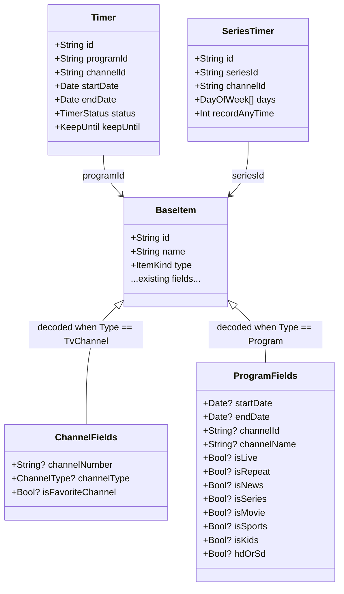
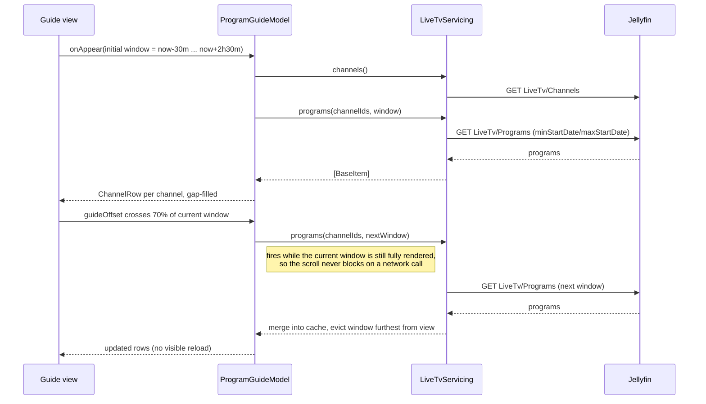

# Live TV design note (0.2)

Working notes for the cable-style EPG guide described in [docs/ROADMAP.md](ROADMAP.md). Scope:
channels, guide grid, watching a channel, recordings and timers. Not scope: SyncPlay, multi-tuner
conflict UI, EPG data source configuration (that's server-side, in Jellyfin's LiveTV plugin
settings).

## Data model

Jellyfin represents channels and programs as `BaseItem`s with `Type: "TvChannel"` /
`Type: "Program"`, so they fit the existing `BaseItem` model in `JellyfinAPI/Models/BaseItem.swift`
with an additive `LiveTvFields` decode rather than a parallel type hierarchy. `ItemKind` already
has `.liveTvChannel` and `.recording` cases (`Enums.swift`), but `.liveTvProgram`'s raw value is
`"TvProgram"` where the server actually sends `"Program"` — see the fix noted under Open
questions/backlog before relying on `item.type == .liveTvProgram` anywhere. New fields needed on
`BaseItem` (all optional, decoded only when requested via `fields`):



`Timer` and `SeriesTimer` are genuinely separate response shapes (not `BaseItem`s) and get their
own `Codable` structs in a new `Models/LiveTvModels.swift`, alongside a `ChannelType` enum
(`.tv`, `.radio`) in `Enums.swift`.

### Time windows

The guide only ever holds one *loaded window* in memory: a contiguous `[Date, Date)` range shared
by every channel's row (typically 3 hours, matching what fits on one tvOS screen at the chosen
column width). A `ProgramGuideModel` (the screen's `@Observable`, following the existing
`HomeModel` / `LibraryBrowseModel` pattern) owns:

```swift
struct GuideWindow: Sendable, Hashable {
    var start: Date
    var end: Date
}

struct ChannelRow: Sendable, Identifiable {
    let channel: BaseItem       // Type == .tvChannel
    var programs: [BaseItem]    // Type == .program, sorted by startDate, gap-filled
}
```

Programs that don't fully cover the window (a show ending mid-window, the guide's provider having
a gap) are padded with synthetic "No Data" placeholder items client-side rather than leaving holes
— this keeps the grid's layout math (below) simple and matches what other Jellyfin clients do.

## EPG grid layout

Both platforms share one layout idea — a fixed leading channel column plus a horizontally
scrolling timeline, one row per channel, cell width proportional to duration — and diverge only in
what drives the scroll: focus on tvOS, drag/paging on iOS. This is the `Metrics` pattern already
used everywhere else (`DesignSystem/Metrics.swift`): the two platforms get different constants and
input handling, not different views.

```
┌─────────────┬──────────────────────────────────────────────────────────────┐
│   (empty)   │  12:00        12:30        13:00        13:30      │ time ruler
├─────────────┼──────────────────────────────────────────────────────────────┤
│ BBC One  [+]│ [ Program A      ][ Program B      ][ Program C          ]   │
│ BBC Two  [+]│ [ Program D                    ][ Program E             ]    │
│ ITV1     [+]│ [ Program F  ][ Program G                    ]              │
└─────────────┴──────────────────────────────────────────────────────────────┘
                    ▲ "now" line (fixed x, drawn over every row)
```

### Structure

- **Two nested scroll axes, not one 2-D scroll view**: a vertical `List`/`ScrollView` of channel
  rows, each row an `HStack` of program cells inside its own horizontal `ScrollView`. A 2-D
  `ScrollView` fights both platforms' native scroll/focus behaviour and was rejected for that
  reason (see "Native or nothing" in `docs/ARCHITECTURE.md`).
- **Synchronised horizontal scroll**: one `@State`/`@Observable` `guideOffset` (a `CGFloat` on
  iOS via `ScrollView`'s `.scrollPosition`, or the focused column index on tvOS) is written by
  whichever row the user is interacting with and read by every other row plus the time ruler.
  iOS 26's `ScrollView(.horizontal) { }.scrollPosition(id:)` binding removes the need for manual
  `PreferenceKey` offset plumbing between rows.
- **Fixed channel column**: the channel column is a separate `LazyVStack` pinned via
  `.pinnedViews` / an overlay, not the leading cell of each `HStack` — otherwise it would scroll
  with the programs.
- **Cell width**: `pointsPerMinute * durationMinutes`, with `pointsPerMinute` a `Metrics` constant
  (larger on tvOS, where cells hold more text and 10-foot readability matters). A minimum cell
  width keeps very short programs (news bulletins) tappable/focusable rather than collapsing to a
  sliver.
- **"Now" line**: a thin vertical `Capsule` overlay at
  `x = (now - window.start) in minutes * pointsPerMinute`, positioned in the same coordinate space
  as the program cells (an `overlay` on the horizontally-scrolling content, not the outer
  container, so it scrolls with the timeline and stays aligned with the ruler). Recomputed on a
  once-a-minute `Timer`/`TimelineView(.periodic(from:by:))`, not per-frame.
- **Time ruler**: a single row above the channel rows showing half-hour marks; scrolls in lockstep
  with the program cells via the same offset binding, stays pinned vertically.

### tvOS focus

- Each program cell is a `Button` with `.buttonStyle(.card)` (matching `Cards.swift`'s existing
  tvOS card style), so the focus engine handles magnification/parallax for free — no custom focus
  visuals.
- Vertical focus moves row to row; horizontal focus moves cell to cell within a row. SwiftUI's
  default focus engine handles both once cells are laid out in the natural `VStack` of `HStack`s
  — no `@FocusState` micro-management needed except for restoring focus to "now" on first
  presentation (`.defaultFocus(_:_:)` bound to the current program's cell).
- Scroll follows focus automatically (`ScrollViewReader`/`scrollPosition` bound to the focused
  program's id) rather than the app manually translating focus deltas into offsets.
- Fast-forward through the guide: press right/left on the remote to move cell to cell; a
  "jump 24 h" affordance (channel-up/down or a menu button) pages the whole window forward/back
  rather than requiring many individual focus moves — see open question below on exact remote
  mapping.

### iOS scrolling

- Program rows scroll by drag as normal `ScrollView`s; the channel column stays fixed the same
  way. No focus engine, so the "now" line and time ruler are the only synchronisation concerns.
- A leading/trailing edge pull (or a "Now" button in the toolbar) resets `guideOffset` to the
  current time, mirroring tvOS's default-focus behaviour.
- Tapping a cell for a program that has already started plays it (channel is already open);
  tapping a future program opens a detail sheet with a "Set reminder" / "Record" action, not
  playback.

### Windowed prefetch

`ProgramGuideModel` keeps at most three windows in memory: the current one, and one on each side,
evicting the far one as the user scrolls past a threshold (mirrors `LibraryBrowseModel`'s existing
paging approach, just on a time axis instead of an item-index axis):



`LiveTvServicing` follows the existing `LibraryServicing`/`PlaybackServicing` shape: a protocol
the screen model depends on, one `JellyfinLiveTvService` implementation over typed `Endpoint`s,
easy to stub for previews/tests.

## Jellyfin endpoints

All under the existing `JellyfinClient.send(Endpoint<Response>)` path; new `LiveTvEndpoints` enum
in `JellyfinKit`, same shape as `LibraryEndpoints`/`ShowsEndpoints`.

| Endpoint | Method | Use |
| --- | --- | --- |
| `LiveTv/Channels` | GET | Channel list: `userId`, `isFavorite`, `enableFavoriteSorting`, `sortBy=Number`, paging. Returns `BaseItem`s (`Type=TvChannel`). |
| `LiveTv/Programs` | GET | Guide data for a window: `channelIds` (comma-joined, batched to stay under URL length limits), `minStartDate`, `maxStartDate`, `userId`, `fields`. The core of the windowed prefetch above. |
| `LiveTv/Programs/Recommended` | GET | "On now" / "Coming up" shelves outside the grid (parity with Home's shelves), optional for 0.2. |
| `LiveTv/GuideInfo` | GET | The server's own known guide data range — bounds how far the guide can page before hitting "no data". |
| `Items/{channelId}/PlaybackInfo` | POST | Same call as VOD playback, with `autoOpenLiveStream: true` in the request body so the server opens the tuner instead of expecting a pre-existing `MediaSourceId`. Reuses `PlaybackEndpoints.playbackInfo` plumbing; `PlaybackInfoRequest` gains the flag. |
| `LiveTv/LiveStreamFiles/{streamId}/{container}` or the `TranscodingUrl` from the above | GET | The actual stream, resolved through the existing `resolveStream` logic — live channels always come back as `.transcode` or `.directStream`, never local seek, so `PlaybackSession`'s progress reporting is skipped for live (no `positionTicks` that mean anything) but `Sessions/Playing` / `Sessions/Playing/Stopped` are still sent so the server's tuner/session accounting stays correct. |
| `LiveTv/Recordings` | GET | Recordings list: `userId`, `isInProgress`, paging. Returns `BaseItem`s (`Type=Recording`, already a case in `ItemKind`). |
| `LiveTv/Recordings/{id}` | GET / DELETE | Recording detail; delete a completed recording. |
| `LiveTv/Timers` | GET | Scheduled/active single-event timers. |
| `LiveTv/Timers/{id}` | GET / POST / DELETE | Read, create (or update by re-POSTing the full defaults payload), cancel a single-event recording. |
| `LiveTv/Timers/Defaults` | GET | Pre-filled `NewTimerDefaults` for a given `programId`, the standard way to seed the "Record" sheet. |
| `LiveTv/SeriesTimers` | GET | Series recording rules. |
| `LiveTv/SeriesTimers/{id}` | GET / POST / DELETE | Read, create/update, cancel a series rule. |

Channel favouriting reuses the existing `UserDataEndpoints.markFavorite/unmarkFavorite` (they
already take a bare `itemID` and work for any `BaseItem`, channels included).

## Open questions

- **iOS surface**: own tab, or a section under Library? Roadmap defers this to "decide with
  usage" — leaning toward its own tab given how different the interaction model is from every
  other iOS screen (this is the one place iOS gets synchronised horizontal scrolling), but no
  telemetry exists yet to confirm demand.
- **tvOS remote paging**: what moves the window by a day vs. by a page-width of cells — Menu/Play
  button combinations on the Siri Remote are already claimed by player dismissal
  (`docs/ARCHITECTURE.md`'s platform differences table); needs a concrete remote-mapping decision
  before the tvOS guide view is built, not just "arrow keys move focus".
- **Batching `channelIds`**: servers with 100+ channels may need `LiveTv/Programs` called in
  batches per visible window rather than one request with every channel id — needs testing
  against a real multi-channel Jellyfin instance to find a sane batch size.
- **Placeholder "No Data" cells**: server-synthesised vs. client-synthesised. Client-side is
  simpler and is what's assumed above, but means the app's guide can visually diverge slightly
  from other Jellyfin clients pointed at the same server.
- **Radio channels**: `ChannelType.radio` exists in the API; out of scope for the visual grid
  (no artwork/backdrop worth showing) but should at minimum be playable — worth a decision on
  whether they appear in the grid at all or only in a channel list.
- **`ItemKind.liveTvProgram` raw value**: currently `"TvProgram"` in `Enums.swift`; Jellyfin's
  server sends `"Program"`. Harmless today (nothing decodes programs yet, and `LenientStringEnum`
  falls back to `.unknown` rather than throwing), but it needs correcting before any code
  branches on `item.type == .liveTvProgram` — flagged as its own backlog issue rather than fixed
  here, since fixing it is a one-line code change and out of scope for a docs-only pass.
- **DVR conflict UI**: multiple timers wanting the same tuner is a server-side concept
  (`TimerInfoDto.status` can report a conflict) with no client UI designed yet; deferred past 0.2
  unless testing surfaces it as a common case.
- **Offline guide cache**: whether the last-loaded window should be cached to disk so re-opening
  the guide isn't always a blank loading state — not designed here, follows from how
  `Marquee/Shared/Services/ImageLoader.swift`'s caching approach generalises (or doesn't) to JSON.
